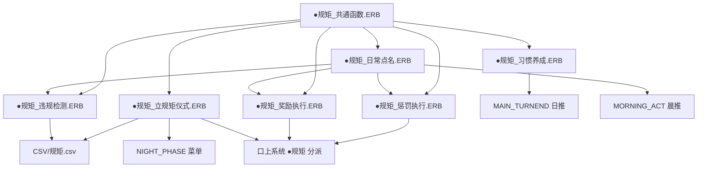

# era魔界牧場 开发档案

---

## Plan C: 主人规矩·奴隶使用体系 — 系统架构设计

> **状态**: 架构设计阶段（待审批后开始编码）\
> **设计日期**: 2026-05-01\
> **对应概念**: 立规矩仪式 / 日常点名 / 惩罚阶梯 / 奖励体系 / 规矩层级 / 契约系统 / 习惯养成

---

### 1. 系统概述

**主人规矩·奴隶使用体系** 为牧场添加一套完整的纪律管理系统。牧场主对每个奴隶建立规矩（契约），通过每日点名检查遵守情况，对违规者施加分级惩罚，对遵守者给予分级奖励。规矩分为三个层级（铁律/常规/建议），随着时间推移，规矩会内化为奴隶习惯。

**核心设计原则**:
- 复用现有 CFLAG/FLAG/CSTR 体系，不新增数据类型
- 复用 `KOJO_PRINT` 口上分派机制，与 22 个性格文件兼容
- 低侵入性接入主循环，不打断现有日程流程
- 所有数值效果与现有 SOURCE/PALAM/BASE 系统联动

---

### 2. 文件结构

#### 2.1 新建 ERB 文件

```
ERB/○MAIN_PHAZE/
├── ●规矩_立规矩仪式.ERB          # 立规矩仪式主逻辑
├── ●规矩_日常点名.ERB            # 每日点名/晨检主逻辑
├── ●规矩_惩罚执行.ERB            # 惩罚阶梯执行逻辑
├── ●规矩_奖励执行.ERB            # 奖励体系执行逻辑
├── ●规矩_违规检测.ERB            # 违规判定引擎（被点名调用）
├── ●规矩_习惯养成.ERB            # 日次习惯推移计算
└── ●规矩_共通函数.ERB            # 共用辅助函数（契约状态、合规度计算等）

ERB/○口上/汎用口上/
└── メッセージ_规矩.ERB           # 规矩系统泛用口上分派文件

CSV/
└── 规矩.csv                      # 规矩定义表（规则名、层级、图标、检测条件、惩罚等级）

ERB/●CONFIG/
└── (修改) ○牧場コンフィグ.ERB    # 添加规矩系统总开关（CONFIG项目）
```

#### 2.2 修改现有文件

| 文件 | 修改内容 |
|------|---------|
| `ERB/○MAIN_PHAZE/●起床行動.ERB` (`@MORNING_ACT`) | 在早安咬之后，插入 `TRYCALL RULE_ROLL_CALL` |
| `ERB/○MAIN_PHAZE/●夜行動.ERB` (`@NIGHT_PHASE`) | 在菜单中添加 `[X] 订立/修改规矩` 选项 |
| `ERB/○MAIN_PHAZE/●MAIN_ターンエンド.ERB` | 在日结末尾追加 `TRYCALL RULE_DAILY_TICK`（习惯养成日推） |
| `CSV/Cflag.csv` | 追加规矩系统 CFLAG 编号 700-779 |
| `CSV/Flag.csv` | 追加规矩系统 FLAG 编号 5100-5149 |
| `CSV/Cstr.csv` | 追加规矩系统 CSTR 编号 500-519 |
| `CSV/Str.csv` | 追加规矩系统用字符串（层级名、菜单选项等），编号 9200-9249 |
| `ERB/○口上/○口上COMMON.ERB` | 在 `@KOJO_PRINT` 中添加 `CASE "规矩"` 分派入口 |
| 22 个性格口上文件（`ERB/○口上/汎用口上/*口上1.ERB`） | 各添加 `CASE "规矩"` 段，调用对应的规矩口上函数 |

---

### 3. 数据模型

#### 3.1 CFLAG 编号分配（700-779: 规矩系统）

```
; 700-719, 规矩·契约核心
700,规矩_契约等级              ; 0=未签约, 1=口头契约, 2=书面契约, 3=血契
701,规矩_仪式执行日            ; DAY:经过日数（立规矩仪式执行的日期）
702,规矩_铁律激活数            ; 当前激活的铁律条数 (0-8)
703,规矩_常规激活数            ; 当前激活的常规条数 (0-12)
704,规矩_建议激活数            ; 当前激活的建议条数 (0-8)
705,规矩_点名出席天数          ; 该奴隶被点名检查的总天数
706,规矩_今日违规模次数        ; 当天点名中检出的违规项数（日结清零）
707,规矩_违规累计分数          ; 违规分累积池（用于惩罚升级判定）
708,规矩_惩罚当前等级          ; 0=无, 1=口头警告, 2=体罚, 3=禁食, 4=禁闭, 5=性处罚, 6=标记
709,规矩_今日是否已点名        ; 0=未点名, 1=今日已点名（防止重复）
710,规矩_累计违规次数          ; 生涯总违规次数
711,规矩_累计表扬次数          ; 生涯总表扬次数
712,规矩_奖励点数              ; 当前奖励点数池（累积用于换奖励）
713,规矩_上次惩罚日            ; DAY:经过日数
714,规矩_上次奖励日            ; DAY:经过日数
715,规矩_点名连续出勤          ; 连续无违规出勤天数
716,规矩_点名最高连勤          ; 生涯最高连续出勤记录
717,规矩_契约标记状态          ; BIT: 0=未标记, 1=已施加魔法标记

; 720-739, 规矩·铁律激活BIT（每条规矩1BIT，8条）
720,规矩BIT_铁律01             ; 例: "不得对主人说谎"
721,规矩BIT_铁律02             ; 例: "未经许可不得离开指定区域"
722,规矩BIT_铁律03             ; 例: "不得伤害其他奴隶"
723,规矩BIT_铁律04             ; 例: "不得私自使用魔法"
724,规矩BIT_铁律05             ; 例: "必须响应主人的召唤"
725,规矩BIT_铁律06             ; 例: "不得隐藏身体状况"
726,规矩BIT_铁律07             ; 预留
727,规矩BIT_铁律08             ; 预留

; 730-741, 规矩·常规激活BIT（每条规矩1BIT，12条）
730,规矩BIT_常规01             ; 例: "点名时必须端正站立"
731,规矩BIT_常规02             ; 例: "工作期间不得怠惰"
732,规矩BIT_常规03             ; 例: "用餐前需报告"
733,规矩BIT_常规04             ; 例: "就寝前需问候主人"
734,规矩BIT_常规05             ; 例: "保持个人卫生"
735,规矩BIT_常规06             ; 例: "不得与外界私自通讯"
736,规矩BIT_常规07             ; 例: "每日需完成指定训练"
737,规矩BIT_常规08             ; 预留
738,规矩BIT_常规09             ; 预留
739,规矩BIT_常规10             ; 预留
740,规矩BIT_常规11             ; 预留
741,规矩BIT_常规12             ; 预留

; 742-749, 规矩·建议激活BIT（每条规矩1BIT，8条）
742,规矩BIT_建议01             ; 例: "尽量以敬语称呼主人"
743,规矩BIT_建议02             ; 例: "主动协助同伴"
744,规矩BIT_建议03             ; 例: "有空时自行学习"
745,规矩BIT_建议04             ; 例: "自愿分享心得"
746,规矩BIT_建议05             ; 预留
747,规矩BIT_建议06             ; 预留
748,规矩BIT_建议07             ; 预留
749,规矩BIT_建议08             ; 预留

; 750-759, 规矩·习惯养成
750,规矩_铁律习惯度01          ; 0-100, 达到100则该条成习惯（无需点名检查）
751,规矩_铁律习惯度02
752,规矩_铁律习惯度03
753,规矩_铁律习惯度04
754,规矩_铁律习惯度05
755,规矩_铁律习惯度06
756,规矩_铁律习惯度07
757,规矩_铁律习惯度08
758,规矩_常规习惯度01          ; 0-100
759,规矩_常规习惯度02

; 760-779, 规矩·习惯养成续（常规03-12 + 建议01-08 共用）
760,规矩_常规习惯度03
761,规矩_常规习惯度04
762,规矩_常规习惯度05
763,规矩_常规习惯度06
764,规矩_常规习惯度07
765,规矩_常规习惯度08
766,规矩_常规习惯度09
767,规矩_常规习惯度10
768,规矩_常规习惯度11
769,规矩_常规习惯度12
770,规矩_建议习惯度01
771,规矩_建议习惯度02
772,规矩_建议习惯度03
773,规矩_建议习惯度04
774,规矩_建议习惯度05
775,规矩_建议习惯度06
776,规矩_建议习惯度07
777,规矩_建议习惯度08
778,规矩_惩罚连续计数          ; 连续受罚天数（用于加速升级判定）
779,规矩_奖励连续计数          ; 连续受奖天数
```

#### 3.2 CSTR 编号分配（500-519: 规矩系统/契约文本）

```
; 500-519, 规矩·契约文本存储（每奴隶）
500,规矩_契约标题              ; 契约自定义标题（10字以内）
501,规矩_契约正文行1            ; 契约正文第1行
502,规矩_契约正文行2            ; 契约正文第2行
503,规矩_契约正文行3            ; 契约正文第3行
504,规矩_签名栏                ; 签名文本
```

#### 3.3 FLAG 编号分配（5100-5149: 规矩系统全局设定）

```
; 5100-5109, 规矩·系统开关
5100,规矩系统启用              ; 0=关闭, 1=启用（CONFIG可设）
5101,规矩_点名模式             ; 0=手动点名, 1=自动点名（每日晨自动）
5102,规矩_惩罚需确认           ; 0=自动执行, 1=每次惩罚需玩家确认
5103,规矩_点名显示详情          ; 0=简洁, 1=详细（每项规矩单独显示）
5104,规矩_允许跳过点名          ; 0=不可跳过, 1=允许跳过（损失威信）
```

#### 3.4 STR 编号分配（9200-9299: 规矩系统通用文本）

```
; 9200-9209, 规矩·层级名称
9200,规矩_铁律名称              ; "铁律"
9201,规矩_常规名称              ; "常规"
9202,规矩_建议名称              ; "建议"
9203,规矩_契约_口头名称         ; "口头契约"
9204,规矩_契约_书面名称         ; "书面契约"
9205,规矩_契约_血契名称         ; "血契"

; 9210-9219, 惩罚阶梯名称
9210,"口头警告"
9211,"体罚"
9212,"禁食"
9213,"禁闭"
9214,"性处罚"
9215,"魔法标记"

; 9220-9229, 奖励阶梯名称
9220,"口头表扬"
9221,"抚摸"
9222,"减少工作量"
9223,"特殊待遇"
9224,"自由时间"

; 9230-9239, 菜单选项/UI文本
9230,"规矩订立"
9231,"规矩_点名_全员出席"
9232,"规矩_点名_无人违规"
9233,"规矩_点名_发现违规"
```

#### 3.5 CSV 规矩定义表（`CSV/规矩.csv`）

| 列 | 说明 |
|------|------|
| 规矩ID | 唯一编号，对应 CFLAG BIT 偏移 |
| 层级 | 1=铁律, 2=常规, 3=建议 |
| 规矩名称 | 简短中文名 |
| 规矩描述 | 详细规则说明 |
| 契约等级要求 | 需要达到的最小契约等级 (1/2/3) |
| 违规检测类型 | "点检"=点名时检测 / "持续"=持续检测 / "事件"=事件触发 |
| 检测条件 | 检测用的表达式字符串（如 `FLAG:事务工作量 <= 0 AND CFLAG:体力 == 0` 表示怠惰） |
| 基础惩罚分 | 违规一次加多少分 |
| 对应CFLAG_BIT | 720-749 中对应的 CFLAG 编号 |
| 对应习惯度 | 750-777 中对应的 CFLAG 编号 |
| 可用条件 | 额外解锁条件（如 `ABL:恭顺 >= 50`），为空表示无额外条件 |

---

### 4. 流程设计

#### 4.1 整体流程图

```
游戏启动（SHOP菜单）
    │
    ▼
MORNING_ACT（起床行動）
    ├─ 早安咬处理
    ├─ ★ 规矩_日常点名（RULE_ROLL_CALL）  ← 新增插入点
    ├─ 天气显示
    ├─ 早餐/宠物
    └─ ...
    │
    ▼
MAIN_PHASE（日程执行）
    │（规矩系统的违规检测在此处不主动触发，
    │  主要由点名时的状态判定为准）
    │
    ▼
NIGHT_PHASE（夜行動）
    ├─ 日程调整
    ├─ 指定早安咬
    ├─ ★ 订立/修改规矩（菜单新选项）        ← 新增插入点
    ├─ 调教/就寝
    └─ ...
    │
    ▼
MAIN_TURNEND（ターンエンド）
    ├─ 妊娠/产褥推进
    ├─ ★ 规矩_习惯养成日推（RULE_DAILY_TICK） ← 新增插入点
    ├─ 标签日结
    ├─ 育儿日推
    └─ SLAVE_INTERACTION_DAILY
```

#### 4.2 立规矩仪式（@RULE_CEREMONY, `●规矩_立规矩仪式.ERB`）

```
入口: NIGHT_PHASE 菜单选项 [X] 订立/修改规矩
     或 初次获取奴隶时的自动调用（可选）

流程:
  1. 选择目标奴隶（CALL CHARA_SELECT_ALL, 排除已崩坏/虚脱/家畜）
  2. 检查当前契约等级
     - 未签约: 显示「此奴隶尚无契约。是否订立？」
     - 已签约: 显示当前规矩摘要，选项 [修改规矩] [解除契约] [返回]
  3. 选择契约等级（口头/书面/血契）
     - 口头: 可设 铁律≤2, 常规≤4, 建议≤4
     - 书面: 可设 铁律≤4, 常规≤8, 建议≤6
     - 血契: 可设 铁律≤8, 常规≤12, 建议≤8
  4. 逐层选择规矩（铁律 → 常规 → 建议）
     - 每层显示可用规矩列表（从 规矩.csv 读取，灰色显示不满足条件的）
     - 玩家勾选要激活的规矩
     - 每层有推荐选项（根据奴隶性格/陷落状态）
  5. 确认界面: 显示所有选中的规矩，玩家确认
  6. 仪式执行:
     - 播放仪式地文（按契约等级不同）
     - KOJO_PRINT("规矩","立规矩","仪式",契约等级)
     - 更新 CFLAG:规矩_契约等级, CFLAG:规矩_仪式执行日
     - 激活所有选中的 BIT（CFLAG 720-749）
     - 更新 CFLAG:规矩_铁律激活数, 常规激活数, 建议激活数
     - 记录仪式日期
  7. 效果:
     - SOURCE:恭顺 +5~15（按契约等级）
     - SOURCE:隶属 +3~10
     - BASE:精神力轻微降低（0~-5，初次）
     - 如果是修改已有契约: SOURCE:恭顺 +2~8
```

#### 4.3 日常点名（@RULE_ROLL_CALL, `●规矩_日常点名.ERB`）

```
入口: MORNING_ACT 中 TRYCALL（仅当 FLAG:规矩系统启用 && FLAG:规矩_点名模式==1 时自动；
      否则通过夜菜单手动触发）

流程:
  1. 前置检查:
     - FLAG:规矩系统启用 == 1
     - 牧场有至少1名已签约奴隶（CFLAG:规矩_契约等级 > 0）

  2. 全员点名:
     FOR TARGET, 1, CHARANUM:
       - 跳过无契约的奴隶
       - 跳过已标记为「今日已点名」的
       - 跳过虚脱/崩坏（无法参与点名）
       - 显示该奴隶的基础状态摘要
       - 检查每项激活的规矩是否违规（CALL RULE_CHECK_VIOLATION）
       - 如果 FLAG:规矩_点名显示详情 == 1:
           每条规矩逐条显示检查结果（绿色勾/红色叉）

  3. 违规判定（@RULE_CHECK_VIOLATION, `●规矩_违规检测.ERB`）:
     对每条激活规矩:
       - 从 规矩.csv 读取检测条件
       - 执行条件判定
       - 如果违规:
           CFLAG:规矩_今日违规模次数++
           CFLAG:规矩_违规累计分数 += 基础惩罚分 × 层级系数
           (铁律×3, 常规×2, 建议×1)
           CFLAG:规矩_累计违规次数++
           CFLAG:规矩_点名连续出勤 = 0  (重置连勤)
           标记该条违规（用于后续口上和惩罚）
           将违规规矩加入违规列表
       - 如果未违规 且 该条习惯度 < 100:
           CFLAG:规矩_点名连续出勤++
           习惯度增长（见习惯养成）

  4. 口上分派:
     - 全体: KOJO_PRINT("规矩","点名","开始","")
     - 每个奴隶:
       如果0违规: KOJO_PRINT("规矩","点名","合格","")
       如果>0违规: KOJO_PRINT("规矩","点名","违规","违规数")
     - 全体: KOJO_PRINT("规矩","点名","结束","")

  5. 惩罚判定:
     违规分 >= 层级阈值时触发惩罚:
       阈值表:
         >= 3分  → 口头警告 (惩罚等级1)
         >= 8分  → 体罚     (惩罚等级2)
         >= 15分 → 禁食     (惩罚等级3)
         >= 25分 → 禁闭     (惩罚等级4)
         >= 40分 → 性处罚   (惩罚等级5)
         >= 60分 → 标记     (惩罚等级6，永久)

     CALL RULE_EXECUTE_PUNISHMENT (见4.4)

  6. 奖励判定:
     连勤天数 >= 阈值时触发奖励:
       连续3天无违规 → 口头表扬 (奖励等级1)
       连续7天无违规 → 抚摸     (奖励等级2)
       连续14天无违规→ 减工     (奖励等级3)
       连续30天无违规→ 特殊待遇 (奖励等级4)
       连续60天无违规→ 自由时间 (奖励等级5)

     CALL RULE_EXECUTE_REWARD (见4.5)

  7. 标记所有点名奴隶为 CFLAG:规矩_今日是否已点名 = 1
```

#### 4.4 惩罚阶梯（@RULE_EXECUTE_PUNISHMENT, `●规矩_惩罚执行.ERB`）

```
惩罚等级定义:
  0: 无惩罚
  1: 口头警告 - 公开训斥，全体听训
  2: 体罚 - 鞭打/掌掴/罚站/负重
  3: 禁食 - 当日晚餐取消 (CFLAG:晚餐许可=0)
  4: 禁闭 - 单独关押1-3天 (CSTR:日程="小屋就寝"，禁止工作)
  5: 性处罚 - 强制调教/公开羞辱/触手惩罚
  6: 魔法标记 - 永久印记，不可逆转，显示在状态栏

执行逻辑:
  1. 根据违规累计分计算惩罚等级
  2. 连续惩罚加速: 若 CFLAG:规矩_惩罚连续计数 > 0, 阈值降低20%
  3. 玩家确认（如果 FLAG:规矩_惩罚需确认 == 1）:
     显示「目标奴隶违规累积 X 分，触发 [惩罚名称]。执行？」
     [0] 执行  [1] 减轻一级  [2] 豁免（-威信）

  4. 执行:
     按等级调用对应处理:

     口头警告 (Lv1):
       - 地文: 牧场主召集全员，当众训斥该奴隶
       - KOJO_PRINT("规矩","惩罚","口头警告",违规数)
       - SOURCE:耻辱 +5~15
       - SOURCE:恭顺 +3~10
       - BASE:精神力 -2~5
       - CFLAG:规矩_惩罚连续计数++

     体罚 (Lv2):
       - 地文: 施加体罚
       - KOJO_PRINT("规矩","惩罚","体罚",罚种)
       - SOURCE:痛苦 +10~25
       - SOURCE:恭顺 +5~15
       - BASE:体力 -10~30
       - BASE:精神力 -3~8
       - PALAM:恭顺 +50~150

     禁食 (Lv3):
       - CFLAG:晚餐许可 = 0（持续到下次点名通过）
       - SOURCE:屈辱 +8~18
       - BASE:体力 -5（饥饿）
       - KOJO_PRINT("规矩","惩罚","禁食","")

     禁闭 (Lv4):
       - CSTR:日程强制改为 "小屋就寝"
       - CFLAG:可以工作 = 0
       - CFLAG:可以调教 = 0
       - 持续时间: 1~3天（存入临时变量）
       - SOURCE:孤独 +10~20, 屈辱 +10~20
       - KOJO_PRINT("规矩","惩罚","禁闭","天数")

     性处罚 (Lv5):
       - 立即触发一次强制调教（不限时间段）
       - 或: 设置次日强制调教日程
       - SOURCE:侮辱 +15~30, 耻辱 +15~30
       - PALAM:恭顺 +100~300
       - CFLAG:惩罚连续计数+=2
       - KOJO_PRINT("规矩","惩罚","性处罚","")

     魔法标记 (Lv6, 永久):
       - 施加不可逆的魔法刻印
       - CFLAG:规矩_契约标记状态 = 1
       - SOURCE:绝望 +20~40, 隶属 +15~30
       - PALAM:恭顺 +200~500
       - BASE:精神力 -20~40
       - 在状态栏永久显示「𑁍 契约标记」
       - 此惩罚只触发一次（终身）
       - KOJO_PRINT("规矩","惩罚","标记","")

  5. 惩罚后:
     重置 CFLAG:规矩_违规累计分数 = 0（保留必要残留分）
     重置 CFLAG:规矩_今日违规模次数 = 0
     记录 CFLAG:规矩_上次惩罚日
     如果惩罚等级 ≥ 3: 暂停当日的习惯度增长
```

#### 4.5 奖励体系（@RULE_EXECUTE_REWARD, `●规矩_奖励执行.ERB`）

```
奖励等级定义:
  0: 无奖励
  1: 口头表扬 - 当面表扬
  2: 抚摸 - 摸头/拥抱/亲近接触
  3: 减工 - 次日工作量减半
  4: 特殊待遇 - 好的食物/更好的住宿/小礼物
  5: 自由时间 - 允许自由活动半天

执行逻辑:
  1. 根据连勤天数计算奖励等级
  2. 检查冷却: 距上次奖励 ≥ 奖励等级×2 天

  3. 执行:

     口头表扬 (Lv1):
       - 地文: 牧场主温和地表扬该奴隶
       - KOJO_PRINT("规矩","奖励","口头表扬","")
       - SOURCE:安心 +3~8
       - SOURCE:恭顺 +2~5
       - BASE:精神力 +2~5
       - CFLAG:规矩_奖励点数++
       - CFLAG:规矩_上次奖励日 = 当前日

     抚摸 (Lv2):
       - 地文: 牧场主轻轻抚摸该奴隶的头/脸颊
       - KOJO_PRINT("规矩","奖励","抚摸","")
       - SOURCE:安心 +5~12
       - SOURCE:隶属 +3~8
       - BASE:精神力 +3~8
       - PALAM:好感度 +20~50
       - CFLAG:规矩_奖励点数 += 2

     减工 (Lv3):
       - 次日该奴隶的所有日程体力消耗 -30%
       - SOURCE:安心 +8~15
       - CFLAG:规矩_奖励点数 += 3
       - KOJO_PRINT("规矩","奖励","减工","")

     特殊待遇 (Lv4):
       - 可选项:
         [0] 一顿好的晚餐 (BASE:体力 +20, SOURCE:安心 +10~20)
         [1] 换到更好的宿舍 (单间/大房间)
         [2] 一件小礼物 (随机小道具)
       - CFLAG:规矩_奖励点数 += 5
       - KOJO_PRINT("规矩","奖励","特殊待遇",选项)

     自由时间 (Lv5):
       - 次日该奴隶日程改为 "休息／等待"（放假半天）
       - SOURCE:安心 +15~25, 隶属 +10~20
       - BASE:精神力 +10~20
       - CFLAG:规矩_奖励点数 += 10
       - KOJO_PRINT("规矩","奖励","自由时间","")

  4. 特殊: 奖励点数兑换
     可在商店或夜间菜单用奖励点数兑换:
       - 5点: 小礼物
       - 10点: 特殊饰品
       - 20点: 改善住宿
       - 50点: 一次「请求」（自定义合理请求）
```

#### 4.6 违规检测引擎详细设计（`●规矩_违规检测.ERB`）

```
@RULE_CHECK_VIOLATION(TARGET, RULE_ID)
; 单条规矩的违规检测
; 返回: RESULT = 0(合格) / 1(违规)

; 该规矩已被习惯化（习惯度>=100）→ 跳过检测，自动合格
SIF CFLAG:规矩_习惯度 == 100
  RETURNF 0

; 读取规矩定义
CALL RULE_CSV_READ(RULE_ID)
; 返回: 层级, 违规检测类型, 检测条件字符串

; 根据检测类型分支
SELECTCASE 违规检测类型
CASE "点检"
  ; 点名时进行状态快照检测
  ; 检测条件示例:
  ;   铁律01 "不得对主人说谎" → 检查 好感度过低+特定FLAG
  ;   铁律02 "不得离开指定区域" → 检查 CSTR:日程 == "逃跑"相关
  ;   常规01 "端正站立" → 检查 体力>0 AND TEQUIP状态
  ;   常规06 "不得与外界通讯" → 检查 追踪状态
  TRYCALLFORM RULE_CHECK_{规则名}(TARGET)

CASE "持续"
  ; 持续型规矩在整个日程执行过程中检测
  ; 由各日程 @SCHEDULE_RUN 中插入 TRYCALL RULE_CHECK_ONGOING
  ; 在此处暂不处理（本函数仅在点名时被调）

CASE "事件"
  ; 特殊事件触发时检测
  ; 由对应事件函数调用
ENDSELECT

RETURNF RESULT
```

---

### 5. 口上分派设计

#### 5.1 分派入口修改（`ERB/○口上/○口上COMMON.ERB`）

在 `@KOJO_PRINT` 的现有 `SELECTCASE ARGS:0` 中添加:

```erb
CASE "规矩"
  CALL KOJO_GENERAL_RULE_DISPATCH(ARGS:1,ARGS:2,ARGS:3)
  RETURN
```

#### 5.2 泛用规矩口上文件（`ERB/○口上/汎用口上/メッセージ_规矩.ERB`）

```
@KOJO_GENERAL_RULE_DISPATCH(ARGS:1,ARGS:2,ARGS:3)
; ARGS:1 = 场景 ("立规矩"/"点名"/"惩罚"/"奖励")
; ARGS:2 = 子场景
; ARGS:3 = 附加数据

; 根据 CSTR:使用口上 分派到具体性格函数
TRYCALLFORM KOJO_RULE_{CSTR:使用口上}(ARGS:1,ARGS:2,ARGS:3)

; 如果专有口上没有实现，使用默认泛用文本
SIF !MESSAGE_COUNT
  CALL KOJO_RULE_DEFAULT(ARGS:1,ARGS:2,ARGS:3)
```

#### 5.3 各性格文件需要添加的 CASE 条目

每个性格口上文件（`@KOJO_GENERAL_INDEX_*`）的 `SELECTCASE ARGS:0` 中添加:

```erb
CASE "规矩"
  CALL KOJO_RULE_<性格标识>(ARGS:1,ARGS:2,ARGS:3)
```

并在文件中实现 `@KOJO_RULE_<性格标识>(ARGS:1,ARGS:2,ARGS:3)` 函数，内容为:

```erb
@KOJO_RULE_<性格标识>(ARGS:1,ARGS:2,ARGS:3)
; 分派规矩相关口上
SELECTCASE ARGS:1
CASE "立规矩"
  SELECTCASE ARGS:2
  CASE "仪式"
    SELECTCASE ARGS:3
    CASE 1  ; 口头契约
      按陷落状态分叉:
        反抗: CALL MESSAGE_BOX,@"「契、契约……？我才不会承认这种东西！」"
        屈服: CALL MESSAGE_BOX,@"「……明白了。我会遵守的。」"
        恋慕以上: CALL MESSAGE_BOX,@"「能与%MASTER_CALL()%缔结契约，属下万分荣幸……♥」"
    CASE 2  ; 书面契约
      ...
    CASE 3  ; 血契
      ...
    ENDSELECT
  CASE "选择铁律"
    ...
  CASE "选择常规"
    ...
  CASE "选择建议"
    ...
  CASE "确认"
    ...
  ENDSELECT

CASE "点名"
  SELECTCASE ARGS:2
  CASE "开始"
    ...
  CASE "合格"
    ...
  CASE "违规"
    ... ; ARGS:3 = 违规数
  CASE "结束"
    ...
  ENDSELECT

CASE "惩罚"
  SELECTCASE ARGS:2
  CASE "口头警告"
    ...
  CASE "体罚"
    ...
  CASE "禁食"
    ...
  CASE "禁闭"
    ...
  CASE "性处罚"
    ...
  CASE "标记"
    ...
  ENDSELECT

CASE "奖励"
  SELECTCASE ARGS:2
  CASE "口头表扬"
    ...
  CASE "抚摸"
    ...
  CASE "减工"
    ...
  CASE "特殊待遇"
    ...
  CASE "自由时间"
    ...
  ENDSELECT
ENDSELECT
```

#### 5.4 口上 CASE 汇总表

| ARGS:0 | ARGS:1 | ARGS:2 | ARGS:3 | 说明 |
|--------|--------|--------|--------|------|
| "规矩" | "立规矩" | "仪式" | 1/2/3 | 契约等级 |
| "规矩" | "立规矩" | "选择铁律" | 选中数 | 铁律选择 |
| "规矩" | "立规矩" | "选择常规" | 选中数 | 常规选择 |
| "规矩" | "立规矩" | "选择建议" | 选中数 | 建议选择 |
| "规矩" | "立规矩" | "确认" | 总条数 | 确认时 |
| "规矩" | "点名" | "开始" | - | 全员召集 |
| "规矩" | "点名" | "合格" | - | 该奴隶通过 |
| "规矩" | "点名" | "违规" | 违规数 | 该奴隶违规 |
| "规矩" | "点名" | "结束" | - | 点名结束 |
| "规矩" | "惩罚" | "口头警告" | - | 口头警告惩罚 |
| "规矩" | "惩罚" | "体罚" | 罚种 | 体罚执行 |
| "规矩" | "惩罚" | "禁食" | - | 禁食惩罚 |
| "规矩" | "惩罚" | "禁闭" | 天数 | 禁闭惩罚 |
| "规矩" | "惩罚" | "性处罚" | - | 性处罚惩罚 |
| "规矩" | "惩罚" | "标记" | - | 魔法标记 |
| "规矩" | "奖励" | "口头表扬" | - | 口头表扬奖励 |
| "规矩" | "奖励" | "抚摸" | - | 抚摸奖励 |
| "规矩" | "奖励" | "减工" | - | 减工奖励 |
| "规矩" | "奖励" | "特殊待遇" | 1/2/3 | 待遇类型 |
| "规矩" | "奖励" | "自由时间" | - | 自由时间奖励 |

#### 5.5 22个性格文件的函数命名

| 性格 (Str注册名) | 规矩函数名 | 文件名 |
|---|---|---|
| 生真面目1 | `KOJO_RULE_生真面目1` | 生真面目口上1.ERB |
| 堅物1 | `KOJO_RULE_堅物1` | 堅物口上1.ERB |
| 無口1 | `KOJO_RULE_無口1` | 無口口上1.ERB |
| 強気1 | `KOJO_RULE_強気1` | 強気口上1.ERB |
| 元気っ子1 | `KOJO_RULE_元気っ子1` | 元気っ子口上1.ERB |
| 気品1 | `KOJO_RULE_気品1` | 気品口上1.ERB |
| 姉御肌1 | `KOJO_RULE_姉御肌1` | 姉御肌口上1.ERB |
| 非敬語幼め1 | `KOJO_RULE_非敬語幼め1` | 非敬語幼め口上1.ERB |
| 男孩子气1 | `KOJO_RULE_男孩子气1` | ボーイッシュ口上1.ERB |
| 慇懃1 | `KOJO_RULE_慇懃1` | 慇懃口上1.ERB |
| 懦弱1 | `KOJO_RULE_懦弱1` | 懦弱口上1.ERB |
| 大和抚子1 | `KOJO_RULE_大和抚子1` | 大和抚子口上1.ERB |
| 妹系1 | `KOJO_RULE_妹系1` | 妹系口上1.ERB |
| 天然1 | `KOJO_RULE_天然1` | 天然口上1.ERB |
| 人妻1 | `KOJO_RULE_人妻1` | 人妻口上1.ERB |
| 虔诚1 | `KOJO_RULE_虔诚1` | 虔诚口上1.ERB |
| 女仆1 | `KOJO_RULE_女仆1` | 女仆口上1.ERB |
| 愚忠1 | `KOJO_RULE_愚忠1` | 愚忠口上1.ERB |
| 仇恨1 | `KOJO_RULE_仇恨1` | 仇恨口上1.ERB |
| 知心1 | `KOJO_RULE_知心1` | 知心口上1.ERB |
| 温柔大姐姐1 | `KOJO_RULE_温柔大姐姐1` | 温柔大姐姐口上1.ERB |
| 闷骚小姐姐1 | `KOJO_RULE_闷骚小姐姐1` | 闷骚小姐姐口上1.ERB |

---

### 6. 规矩CSV定义表设计

`CSV/规矩.csv` 格式:

```csv
规矩ID,层级,规矩名称,规矩描述,契约等级要求,违规检测类型,检测条件描述,基础惩罚分,CFLAG_BIT,习惯度CFLAG,额外条件
F01,1,不得对主人说谎,"对主人必须诚实，不得故意隐瞒或歪曲事实",1,点检,"好感度 < 500 AND CFLAG:规矩_契约等级 >= 1",10,720,750,
F02,1,不得离开指定区域,"未经许可不得离开牧场指定活动范围",1,事件,"CSTR:日程 含 '逃跑'",12,721,751,
F03,1,不得伤害其他奴隶,"禁止对同伴施加暴力或恶意伤害",1,事件,"发生奴隶间冲突事件",10,722,752,
F04,1,不得私自使用魔法,"未经许可不得使用任何魔法（自卫除外）",2,事件,"魔法使用事件",8,723,753,
F05,1,必须响应主人召唤,"主人召唤时必须立即到场，不得拖延",1,点检,"BASE:体力 > 0 AND 点名时检测召唤响应",8,724,754,
F06,1,不得隐藏身体状况,"身体异常（伤病/怀孕等）必须主动报告",1,点检,"存在隐藏身体异常的检测条件",6,725,755,
N01,2,点名时端正站立,"点名时必须立正、双手放两侧、目视主人",1,点检,"BASE:体力 > 0 AND TEQUIP:拘束 == 0",5,730,758,
N02,2,工作期间不得怠惰,"日程执行中必须认真完成分配的工作",1,持续,"BASE:体力 > 0 AND CSTR:日程非空",5,731,759,
N03,2,用餐前需报告,"每餐前需向主人报告并获许可",1,事件,"用餐事件触发",3,732,760,
N04,2,就寝前需问候主人,"每晚就寝前必须向主人道晚安",1,事件,"SLEEP_ROOM 入口",3,733,761,
N05,2,保持个人卫生,"每日必须完成基本清洁（洗澡/更衣）",1,点检,"STAIN:污れ > 50",4,734,762,
N06,2,不得与外界私自通讯,"禁止未经许可与牧场外任何人联络",2,事件,"通讯事件",6,735,763,
N07,2,每日完成指定训练,"每天必须完成主人指定的训练内容",1,点检,"当日未完成训练日程",4,736,764,
N08,2,着装整洁,"必须保持服装整洁、按规定着装",2,点检,"STAIN:衣服 > 50 或 未穿指定服装",3,737,765,
S01,3,尽量以敬语称呼主人,"建议使用敬语称呼主人（'主人大人'或以上）",1,点检,"称呼未达到指定敬语等级",2,742,770,
S02,3,主动协助同伴,"在完成自己工作后主动帮助其他奴隶",2,事件,"工作协助事件",2,743,771,
S03,3,有空时自行学习,"在空闲时间自主学习（读书/技能练习）",2,持续,"检查是否有图书馆使用记录",1,744,772,
S04,3,自愿分享心得,"定期主动向主人报告自己的训练/工作心得",2,事件,"报告事件",2,745,773,
```

---

### 7. 习惯养成系统设计（`●规矩_习惯养成.ERB`）

#### 7.1 日推入口

```
@RULE_DAILY_TICK
; 在 MAIN_TURNEND 末尾被调用
; 对每个有契约的奴隶:
FOR TARGET, 1, CHARANUM:
  SIF CFLAG:规矩_契约等级 == 0
    CONTINUE

  ; 遍历所有激活规则
  FOR RULE_ID, 1, 28:
    SIF !CFLAG:(720+RULE_ID-1)  ; 该规则未激活
      CONTINUE

    HABIT_FLAG = 750 + RULE_ID - 1
    SIF CFLAG:HABIT_FLAG >= 100  ; 已习惯化
      CONTINUE

    ; 基础日增: 1点
    GAIN = 1

    ; 修正:
    ;  陷落状态加成:
    IF ＃陷落状态／恋慕以上＃: GAIN += 2
    ELSEIF ＃陷落状态／屈服以上＃: GAIN += 1
    ; 契约等级加成:
    GAIN += CFLAG:规矩_契约等级 - 1  ; 口头+0, 书面+1, 血契+2
    ; 惩罚日暂停:
    IF CFLAG:规矩_上次惩罚日 == DAY:经过日数: GAIN = 0
    ; 连勤加成:
    IF CFLAG:规矩_点名连续出勤 >= 7: GAIN += 1

    CFLAG:HABIT_FLAG = MIN(CFLAG:HABIT_FLAG + GAIN, 100)
  NEXT
NEXT
```

#### 7.2 习惯化效果

当某条规矩的习惯度达到 100:
- 该规矩在点名时跳过检查（自动视为合格）
- 在状态面板显示「✓习惯化」
- 该规矩不再可能被违反而触发惩罚

习惯化不可逆（不会退回到100以下）。

---

### 8. 集成点详细说明

#### 8.1 主循环集成（总览）

```
┌─ SHOP (游戏主菜单) ─┐
│                      │
│  CONFIG新增:          │
│  [XX] 主人规矩系统   │  ← 新CONFIG项目 #XX
│   ├─ ON/OFF          │
│   ├─ 点名模式        │
│   └─ 惩罚确认       │
│                      │
└──────────────────────┘
         │
         ▼ 一天开始
┌─ MORNING_ACT ─────────┐
│  早安咬 →                │
│  ★ RULE_ROLL_CALL ★   │  ← TRYCALL（系统启用时）
│  天气/早餐/宠物 ...    │
└────────────────────────┘
         │
         ▼
┌─ MAIN_PHASE ──────────┐
│  日程执行...           │
│  （规矩持续检查可选）   │
└────────────────────────┘
         │
         ▼
┌─ NIGHT_PHASE ─────────┐
│  [0] 调教             │
│  [1] 早安咬指定          │
│  ★ [X] 规矩订立　★    │  ← 新菜单项（仅系统启用时）
│  [2/3] 就寝 ...       │
└────────────────────────┘
         │
         ▼
┌─ MAIN_TURNEND ────────┐
│  妊娠推进 ...          │
│  ★ RULE_DAILY_TICK ★  │  ← TRYCALL
│  SLAVE_INTERACTION     │
│  日结/SHOP戻           │
└────────────────────────┘
```

#### 8.2 与现有系统的交互

| 现有系统 | 交互方式 | 影响 |
|---------|---------|------|
| **陷落状态** | 陷落程度影响规矩遵守意愿 | 反抗: 违规概率+30%; 恋慕以上: 习惯养成加速 |
| **ABL:恭顺** | 高恭顺降低违规概率; 低恭顺增加 | 恭顺<100: 违规率+15%; 恭顺>500: 违规率-20% |
| **训练系统** | 性处罚可直接跳转到训练; 训练中可穿插规矩检查 | 新训练命令可选 |
| **日程系统** | 禁闭改变日程; 减工修改体力消耗 | 直接修改 CSTR:日程 和性能 |
| **CONFIG** | 新增系统开关和参数项目 | 追加到 ○牧場コンフィグ.ERB |
| **SOURCE/PALAM** | 规矩系统大量使用 SOURCE 和 PALAM 来表示心理效果 | 与现有增长曲线兼容 |
| **状态显示** | 在奴隶状态界面新增规矩状态栏 | 追加到 ステータス画面 |
| **口上系统** | 复用 `KOJO_PRINT` 和 MESSAGE_BOX 机制 | 新增 "规矩" 顶级场景 |

#### 8.3 内部依赖图



---

### 9. 实现阶段划分

#### 阶段 1: 基础设施（约2-3天）
- [ ] 创建 `CSV/规矩.csv` 规矩定义表
- [ ] 分配 CFLAG/FLAG/CSTR/STR 编号
- [ ] 修改 `Cflag.csv`, `Flag.csv`, `Cstr.csv`, `Str.csv`
- [ ] 创建 `●规矩_共通函数.ERB`（CSV读取、合规度计算等辅助函数）
- [ ] CONFIG 添加规矩系统开关

#### 阶段 2: 核心逻辑（约3-4天）
- [ ] 创建 `●规矩_立规矩仪式.ERB` 并接入 NIGHT_PHASE
- [ ] 创建 `●规矩_违规检测.ERB` 违规判定引擎
- [ ] 创建 `●规矩_惩罚执行.ERB` 惩罚阶梯
- [ ] 创建 `●规矩_奖励执行.ERB` 奖励体系

#### 阶段 3: 口上（约3-4天）
- [ ] 修改 `○口上COMMON.ERB` 添加规矩分派
- [ ] 创建 `メッセージ_规矩.ERB` 泛用口上分派
- [ ] 为 22 个性格文件添加 CASE "规矩" 条目
- [ ] 实现每个性格的基础规矩口上（至少各性格写: 仪式/点名合格/点名违规/口头表扬/口头警告 五个核心场景）

#### 阶段 4: 日推与点名（约2天）
- [ ] 创建 `●规矩_日常点名.ERB` 并接入 MORNING_ACT
- [ ] 创建 `●规矩_习惯养成.ERB` 并接入 MAIN_TURNEND
- [ ] 连勤/连续惩罚统计逻辑

#### 阶段 5: 测试与调整（约2-3天）
- [ ] 各性格口上测试
- [ ] 数值平衡调整
- [ ] 边界情况测试（无契约、全员崩坏、存档兼容等）

---

### 10. 关键技术决策总结

| # | 决策 | 理由 |
|---|------|------|
| 1 | CFLAG 使用 700-779 范围 | 700-899 区间完全空闲，不与其他系统冲突 |
| 2 | FLAG 使用 5100+ 范围 | 现有使用到 ~5013，5100+ 安全 |
| 3 | CSTR 使用 500-519 | 契约文本需要少量 CSTR 存储 |
| 4 | STR 使用 9200-9299 | 现有命名区域外，安全 |
| 5 | CSV 驱动规矩定义 | 规矩名、检测条件、惩罚分都在 CSV 中，易于修改和扩展 |
| 6 | 口上分派复用 KOJO_PRINT | 不新增分派机制，与 22 性格完全兼容 |
| 7 | TRYCALL 接入主循环 | 系统关闭时零开销，不给旧存档增加负担 |
| 8 | 习惯度用 CFLAG 而非独立变量 | 利用现有 CFLAG 1000 槽容量，无需扩展数据类型 |
| 9 | 分段实现 | 基础设施→核心逻辑→口上→日推→测试，可随时暂停和交付 |
| 10 | 惩罚等级上限（Lv6 永久标记） | 防止无限惩罚循环，最高等级施加终身后果后不再升级 |

---

### 11. 风险与注意点

1. **CFLAG 消耗量大**: 本系统占用约 80 个 CFLAG 槽（700-779）。CFLAG 总量 1000，当前空闲约 700-899（200槽）和 944-999（56槽），需确认没有其他并行开发冲突。

2. **口上工作量**: 22 个性格文件每个需新增约 16 个 CALL MESSAGE_BOX 条目。预计每个文件新增约 50-200 行。最保守估计总量约 2000-3000 行口上。

3. **存档兼容性**: 旧存档的规矩 CFLAG 均为 0（未初始化），应正确处理为「未签约」状态。新增 FLAG 5100 默认为 0（系统关闭）。

4. **平衡性**: 惩罚/奖励的数值效果需要实际测试调整。初次实现使用保守数值。

5. **与早安咬的时序**: 点名在早安咬之后执行，即点名场景中奴隶已经结束早安咬活动。如果早安咬奴隶也是点名对象，需确保其状态连贯。

---

### 12. 配色与显示规范

- 规矩系统 UI 使用主色调: **深金色**（COLOR 219,178,0）或 **暗红**
- 铁律显示: 红色 `#FF4444`
- 常规显示: 金色 `#DDB200`
- 建议显示: 灰蓝色 `#8899AA`
- 违规标记: 红色 `✗`
- 合格标记: 绿色 `✓`
- 习惯化标记: 蓝色 `◈`
- 惩罚等级 5+ 显示: 暗紫 `#8844AA`

---

## 附录: 口上写作指引（供各性格口上作者参考）

每个性格的规矩口上应体现该性格的核心特征:

| 性格 | 立规矩反应基调 | 违规反应基调 | 表扬反应基调 |
|------|-------------|------------|------------|
| 生真面目 | 严肃接受，暗记规矩 | 自责、反省 | 谦逊接受，但暗自高兴 |
| 堅物 | 沉默点头 | 抿唇不语，强忍屈辱 | 轻微脸红 |
| 無口 | 简短"明白了" | 低头不语 | 微不可察的嘴角上扬 |
| 強気 | 表面答应，内心不忿 | 辩解/嘴硬 | "……谢，谢谢。" |
| 元気っ子 | "はいはいー！" 精力充沛 | 垂头丧气 | 眼睛放光，大声谢谢 |
| 気品 | 优雅行礼，"承知しました" | 面色不变但手指微抖 | 优雅微笑，"光栄です" |
| 姉御肌 | 仿佛在听妹妹的规矩 | 苦笑/自嘲 | 像被夸奖的小孩 |
| 非敬語幼め | "えー？めんどー……" | 嘟嘴不情愿 | "やったー！" 蹦跳 |
| 男孩子气 | 挠头，"知道啦知道啦" | "切……" 不服 | 别过脸去偷笑 |
| 慇懃 | 恭敬行礼，完美回应 | 面不改色，内心痛苦 | 更加恭敬，"恐悦至極" |
| 懦弱 | 畏缩发抖，"は、はい……" | 几乎要哭出来 | 如释重负，眼含泪光 |
| 大和抚子 | 温婉称是 | 悄然垂泪 | 露出温柔的微笑 |
| 妹系 | 乖巧点头，"わかった！" | 眼眶湿润，抿嘴 | 开心地贴近主人 |
| 天然 | 似乎不太理解但点头 | 歪头不解自己哪里错了 | 露出天真笑容 |
| 人妻 | 包容地微笑，"はい" | 微微叹气，反思 | 温柔地道谢 |
| 虔诚 | 仿佛接受神谕 | 祷告般的忏悔 | 感动到落泪 |
| 女仆 | 职业式服从，"かしこまりました" | 低头，"申し訳ございません" | "お褒めいただき光栄です" |
| 愚忠 | 誓言般的承诺 | 极度痛苦的自我惩罚 | 感动到语无伦次 |
| 仇恨 | 冷笑/沉默/咬唇 | 眼中闪过憎恨 | 表情复杂，似乎有所动摇 |
| 知心 | 理性地分析规矩合理性 | 坦率承认，"确实是我的疏忽" | 真诚地微笑 |
| 温柔大姐姐 | 温和地接受 | 微微叹息，认真反思 | 温柔地抚摸主人的头 |
| 闷骚小姐姐 | 表面淡定，内心慌乱 | 面红耳赤，"请、请处罚" | 压抑住兴奋，绷住表情 |
