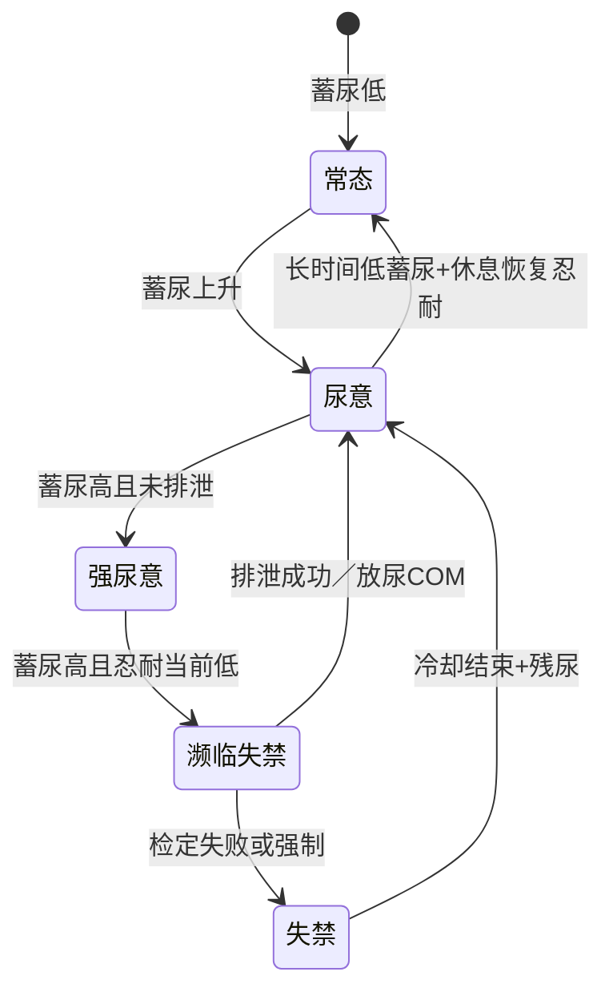

# 膀胱条／忍耐度／失禁 — 独立系统设计（era-makai-ranch）

> **总纲关系**：本文件为 **「排泄·失禁·耻辱·调教」大系统** 中的 **尿路与膀胱子模块** 规格。合并路线图见 Cursor 计划 **「排泄失禁耻辱调教大系统」**；仓库内摘要与已实现入口见 **[排泄羞耻调教系统.md](./排泄羞耻调教系统.md)**。工程目录 **`ERB/○排泄羞耻/`**（`EXCRETION_ACCIDENT` / `EXCRETION_PERMITTED_RELEASE`、COM223 初版等）。

> 定位：**与现有「放尿／饮尿／灌肠」指令地文并列的底层资源系统**，用统一数值驱动 UI、调教结算、日程与口上分支；**不替代**现有 COM 演出，而是为其提供「为何想尿／为何憋不住」的因果与成长线。与 **肠路（灌肠）** 在 **腹压／失禁／耻辱** 上可联动，详见上述大计划 **§4 子系统交互规则**。

---

## 1. 设计目标

| 目标 | 说明 |
|------|------|
| **可感知** | 玩家能在状态栏／调教 HUD／灰字提示中看到「蓄尿」「忍耐」「濒临失禁」梯度。 |
| **可决策** | 日程、访问、入浴、调教中形成「去厕所／硬憋／被命令憋尿／失禁风险」的取舍。 |
| **可扩展** | 道具、标签、妊娠、拘束、药物、镜子 PLAY 等只读/写少量 **CFLAG／TFLAG／MARK**，通过 `TRYCALL` 钩子接入。 |
| **可叙事** | `KOJO_PRINT` 统一入口（新分类如 `"身体","膀胱"`），地文与泛用口上可渐进补全。 |

---

## 2. 核心概念（三条主条）

### 2.1 膀胱条（蓄尿）

- **语义**：距离「强烈尿意／失禁阈值」有多满，**不是**现实毫升，而是 **0～10000** 的归一化条（与 `PALAM` 量级习惯一致，便于和 `LIMIT` 搭配）。
- **增长来源（示例）**  
  - 时间：日程每经过一定「小时等价」或每个 MAIN 阶段 `+Δ`（可配置）。  
  - 饮水：**已实现** — 奴隶饮用／被给予 **营养饮料**（`USE_ITEM_PLAYER_ENERGY_DRINK`／`VISIT_TAKE_ENERGY_DRINK`）时 **`TRYCALL EXCRETION_BLADDER_ON_NUTRITION_DRINK`**：`膀胱_当日饮水计数` 递增并推高 **`膀胱蓄尿`**、略削 **`膀胱忍耐_当前`**；日结时计数清零（`EXCRETION_DAILY_ALL`）。茶、酒类等仍可按需另接同一函数族。  
  - 利尿／媚药副作用：`SOURCE` 或道具标记叠层。  
  - 妊娠／压迫：按孕期档位加被动增长。  
- **减少来源**  
  - 正常排泄：入厕事件、**放尿系 COM** 成功结算时大幅扣减。  
  - 事故失禁：一次性清空到「残尿」低位（非零可选，用于连续失禁叙事）。

### 2.2 忍耐度（意志对抗）

- **语义**：**本轮或本日内**「夹紧能扛多久」的缓冲，与 **精神力／尊严／陷落／怕痛** 等挂钩，**会被消耗**。  
- **建议拆两条以免混淆**  
  1. **`膀胱忍耐_基础`**：**已实现** — `EXCRETION_DAILY_ALL` 每人每日 `+1～+4`（封顶 5000），随当日高蓄尿、羞耻链／无肛塞状态、漏尿累计略加速。  
  2. **`膀胱忍耐_当前`**：当日或当回合调教内消耗，休息／睡眠／入浴恢复。  
- **消耗触发**：**已实现初版** — `EXCRETION_BLADDER_TRAIN_AFTER_SOURCE`（`SOURCE_UP` 之后）按 **腹压负担**、**羞耻调教余回合**、**当回合绝顶**、**灌肠系 SELECTCOM** 及羞耻链 COM 对 **`膀胱忍耐_当前`** 扣减（单次封顶 230）；高耻辱 `SOURCE` 阈值类可后续再接。  
- **与膀胱条关系**：判定顺序为  
  `蓄尿压力` vs `有效忍耐` → 失败则进入 **濒临失禁** 子状态或直接 **失禁检定**。

### 2.3 失禁（结果层）

- **类型（建议枚举）**  
  - **主动／命令下释放**（走现有放尿 COM，只扣膀胱条）。  
  - **濒临失禁 → 玩家选择「去厕所／继续」**：**已实现** — `EXCRETION_BLADDER_NEARMISS_CHOICE`（`BLADDER_TRY_URINE_ACCIDENT` 内，蓄尿 7500～8199、有耗时指令、概率触发）：角落减压、硬撑、或 **`CALL EXCRETION_PERMITTED_RELEASE`**。  
  - **被动失禁**：战斗、调教、访问中 **检定失败**；可分子类型：少量漏出／完全失禁／连带粪便（若将来与排泄扩展联动，需单独开关）。  
- **与「肠路」统一出口（大系统）**：尿失禁与灌肠后 **忍不住排泄** 可共用 **`EXCRETION_ACCIDENT`**（实现为 `CALL EXCRETION_ACCIDENT, 1|2`），底层统一写 **`SOURCE:不洁／耻辱／屈辱`**、冷却、口上占位。**肠型不是失败**，而是 **忍不住 → 羞耻调教余回合**（`CFLAG:排泄_羞耻调教余回合`）。  
- **与「主人公准许排泄」分流**：准许（含已塞或未塞肛塞后放行）**不走** `EXCRETION_ACCIDENT`，而走 **`EXCRETION_PERMITTED_RELEASE`**：奴隶去 **调教场所旁洗手间**；若持有 **调教立镜** 可选 **对着镜子以把尿姿势排尿／排出**，或 **便盆在房内排泄**；**不叠**「忍不住」的高耻辱事故倍率。  
- **粪便与臭气（简短）**：灌肠相关地文允许 **一笔带过** 的粪便与臭气；**不写长、不写细**。**`FLAG:排泄描写／灌肠粪便简短`**（5010）为 1 时肠型事故用更直白的一句；为 0 则淡化污物描写。  
- **后果（数值）**：`SOURCE:不洁`／`SOURCE:耻辱` 等（与现有饮尿等写法一致）、**污渍 TFLAG**（若工程已有污渍系统则复用）、当日 **标签** 写入（短期 CFLAG 剩余日数）。  
- **冷却**：`CFLAG:失禁冷却_剩余回合` 防止同一小时连刷；**严重失禁**可叠「羞耻记忆」长期 MARK。

---

## 3. 数据落点（建议）

### 3.1 奴隶用 CFLAG（持久，建议占用 916～925 一段连续号，与 `Cflag.csv` 登记）

| ID（建议） | 名称 | 范围／单位 | 说明 |
|------------|------|------------|------|
| 916 | 膀胱蓄尿 | 0～10000 | 主条；UI 与判定的核心。 |
| 917 | 膀胱忍耐_当前 | 0～10000 | 当回合／当日消耗型。 |
| 918 | 膀胱忍耐_基础 | 0～5000 | 慢养成「习惯」。 |
| 919 | 失禁冷却 | 0～20 | 回合或「时段」递减。 |
| 920 | 膀胱_当日饮水计数 | 0～99 | 与营养饮料等叠加。 |
| 921 | 膀胱_压力倍率BIT | BIT | 妊娠压迫／药物／拘束等叠层。 |

（余量 922～925 预留给「漏尿次数累计」「上次失禁 DAY」等。）

### 3.2 TFLAG（场景内）

- `TFLAG:膀胱检定中` `TFLAG:失禁演出跳过` 等，防止 `SOURCE_CHECK` 递归与口上轰炸。

### 3.3 可选 MARK（长期）

- 「失禁癖」「禁尿嗜好」「膀胱脆弱」等，从反复失禁或调教养成解锁，供 `SOURCE_UP` 微修正与口上分支。

### 3.4 主人公是否接入

- **默认只做奴隶**，逻辑全在 `TARGET` 非 0；若将来要 **主人公膀胱条**，建议 **独立一套 CFLAG:0:…** 或复用同一子程序 `ARG:角色区分`，避免与 `精力` 系统混淆。

---

## 4. 状态机（简图）



---

## 5. 与现有系统的衔接表

| 模块 | 衔接方式 |
|------|----------|
| **日次／阶段** | `MAIN_TURNEND` 或 `PREGNANCY_DAILY` 同级：`TRYCALL BLADDER_DAILY_ALL`（全员 FOR）。 |
| **调教** | `SOURCE_CHECK` 前或 `COMMAND_AFTER`：`蓄尿被动增长`、`忍耐消耗`；放尿／饮尿 COM 末尾 `CALL BLADDER_VOID`。 |
| **入浴** | 现有「洗屁眼／灌肠」文案链：成功入浴「排尿」选项时 `BLADDER_VOID` + 恢复部分 `忍耐_当前`。 |
| **访问** | **已实现灰字+口上** — `EXCRETION_VISIT_BLADDER_HOOK`（`会いに行く.ERB` 入口后）：高蓄尿时概率；`KOJO_PRINT("访问","排泄尿急",…)`。短选项「一起去洗手间」可再接扩展。   |
| **状态 UI** | `◯詳細ステータス用関数` 或 `パーソナルデータ` 增加一行条（灰字说明压力来源）。 |
| **镜子 PLAY** | 已有 `放尿` 加成：读 `蓄尿` 档位加权 `SOURCE:耻辱`。 |
| **口上** | `KOJO_PRINT("身体","高蓄尿"|"羞耻调教链", …)`（`EXCRETION_TRAIN_PRE` 概率）；泛用口上见知心／大和抚子／闷骚等 `EXCRETION_BODY`；拜访侍奉口爆终了 `KOJO_PRINT("访问","侍奉口爆终了","忍住"|"咽下",…)`。   |

---

## 6. 检定公式（建议稿，可调参）

- **有效忍耐**  
  `EFF = CFLAG:膀胱忍耐_当前 + CFLAG:膀胱忍耐_基础/2 + 精神力%/系数 + (陷落?加成)`  
- **失禁阈值**  
  `TH = 8000 + 妊娠档*200`（示例）  
- **当 `蓄尿 > TH` 且 随机(1,100) > EFF/100`** → 触发失禁分支（或二段：先「漏一点」再升级）。  

常数全部收拢到 **`ERB/○膀胱失禁/◯膀胱失禁_定数.ERB`** 或 `広域定数.ERH` 子块，便于难度 CONFIG。

---

## 7. 分期落地（建议）

| 阶段 | 内容 | 验收 |
|------|------|------|
| **P0** | `Cflag.csv` 登记 + `BLADDER_DAILY_ALL` 仅蓄尿缓慢增长 + 状态栏显示 | 不报错、存档兼容。 |
| **P1** | 放尿系 COM 与入浴排尿挂钩 `BLADDER_VOID`；忍耐_当前日结恢复 | 与现有地文一致、数值可感。 |
| **P2** | 调教中消耗忍耐 + 濒临检定 + 失禁地文 + 污渍 | 与镜子 PLAY、PALAM 联动。 |
| **P3** | 访问短事件、标签、MARK、CONFIG 难度、泛用口上批次 | 与《口上与玩法扩展同步规则》一致。 |

---

## 8. 风险与约束

- **存档**：新增 CFLAG 默认 0 即安全；勿复用已占用 ID。  
- **性能**：日次全员 FOR 只做整数加减，避免嵌套 `SOURCE_CHECK`。  
- **叙事边界**：与「排泄」相关的口味开关建议放在 **CONFIG BIT**，默认温和（仅尿、不联动粪除非显式开启）。  
- **与精力系统**：**不要**混用 `BASE:精力`；膀胱是独立条，仅文案可偶尔玩梗「下面憋上面也虚」。

---

## 9. 推荐文件结构（实现阶段）

```
ERB/○膀胱失禁/
  ●膀胱失禁_CORE.ERB      ; 日次、入口、检定
  ◯膀胱失禁_定数.ERB      ; 倍率表
  ◯膀胱失禁_UI.ERB        ; 状态栏、调教灰字
  ◯膀胱失禁_钩子_调教.ERB ; TRYCALL 列表与 COM 对接说明
```

---

## 10. 小结

本系统以 **`膀胱蓄尿` + `忍耐双轨` + `失禁结算与冷却`** 为铁三角，用 **日次 + 调教钩子 + 现有排泄 COM** 串起闭环；先 **数据与可见条**，再 **检定与演出**，最后 **标签与口上**，符合当前工程「可扩展、可欠番口上」的维护方式。

如需下一步，可在 **P0** 直接落地 `916` 起 CFLAG 与 `BLADDER_DAILY_ALL` 空壳（`TRYCALL`），再在 `放尿` COM 末行接 `BLADDER_VOID` 最小闭环。
